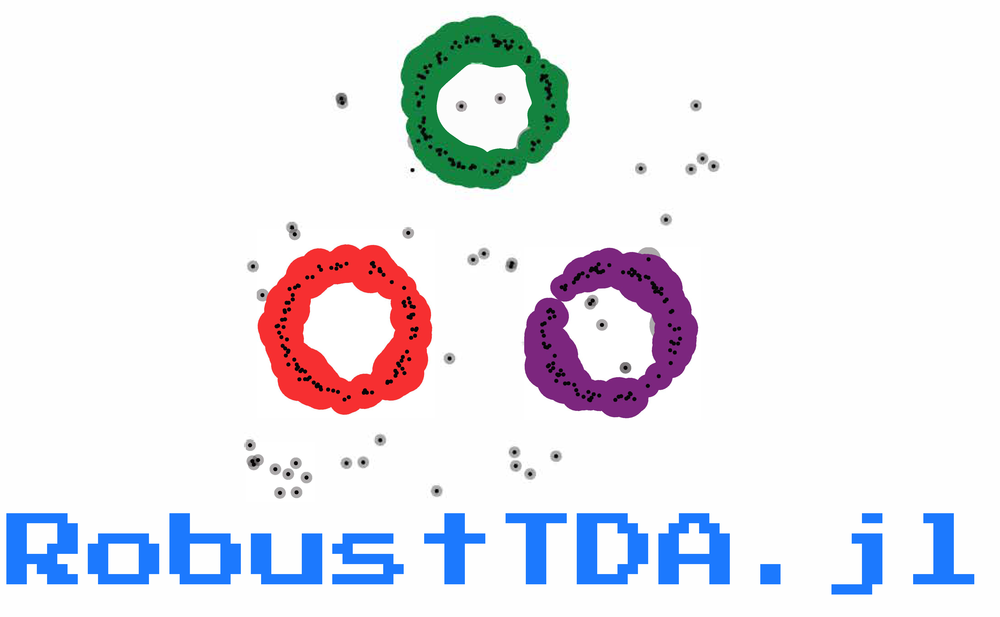

<div align="center">
  

_Robust Topological Data Analysis in Julia._

[](https://sidv23.github.io/RobustTDA.jl/stable)
[](https://sidv23.github.io/RobustTDA.jl/dev)
[](https://github.com/sidv23/RobustTDA.jl/actions/workflows/CI.yml?query=branch%3Amain)
[](https://codecov.io/gh/sidv23/RobustTDA.jl)

</div>


# RobustTDA.jl

`RobustTDA.jl` provides a robust and flexible framework for computing persistent homology from point-cloud data in the presence of noise. RobustTDA uses the blazing fast  backend for computing persistent homology. 

Please see the  for further information, usage and examples.

# Getting Started

### Installation
From the Julia REPL, type `]` to enter the Pkg REPL mode and run
```julia
    pkg> add https://github.com/sidv23/RobustTDA.jl
```

### Example

Generate some data

```julia
using RobustTDA
using Pipe

signal = randCircle(500, sigma=0.1)
noise = randUnif(100, a=-2, b=2)
points = [signal; noise]
scatter(points)
```


First, convert the data to a vector-format, i.e.,
```julia
Xn = [[x...] for x in points]
```
<sub><sup>*All rountines in the package currently read the input point-cloud data as a vector of vectors</sub></sup>


Construct a filter function from the samples $\mathbb{X}_n$. For example,

1. Vanilla Distance function:
    ```julia
        f_dist = dist(Xn)

        # RobustTDA.DistanceFunction
        # k: Int64 1
        # trees: Array{KDTree{StaticArrays.SVector{2, Float64}, Euclidean, Float64}}((1,))
        # X: Array{Vector{Vector{Float64}}}((1,))
        # type: String "dist"
        # Q: Int64 1
    ```
2. Median-of-means Distance Function:
   ```julia
        f_momdist = momdist(Xn, 201)

        # RobustTDA.DistanceFunction
        # k: Int64 1
        # trees: Array{KDTree{StaticArrays.SVector{2, Float64}, Euclidean, Float64}}((201,))
        # X: Array{SubArray{Vector{Float64}, 1, Vector{Vector{Float64}}, Tuple{Vector{Int64}}, false}}((201,))
        # type: String "momdist"
        # Q: Int64 201
    ```
3. Distance-to-measure:
    ```julia
        f_dtm = dtm(Xn, 0.1)

        # RobustTDA.DistanceFunction
        # k: Int64 60
        # trees: Array{BruteTree{StaticArrays.SVector{2, Float64}, Euclidean}}((1,))
        # X: Array{Vector{Vector{Float64}}}((1,))
        # type: String "dtm"
        # Q: Int64 1
    ```